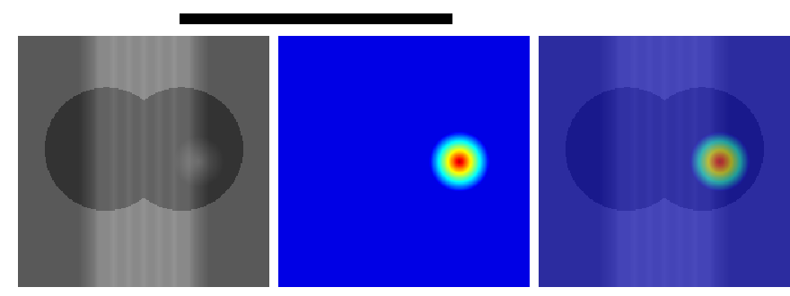

<div align="center">

# 🫁 胸部X光肺炎分类系统

[](https://www.python.org/)
[](https://pytorch.org/)
[](https://fastapi.tiangolo.com/)
[](LICENSE.md)

**基于 Vision Transformer 和 Vision Mamba 的肺炎自动分类系统**

[English Version](#english-version) | [中文说明](#中文说明)

</div>

---

## 📖 中文说明

### ✨ 核心特性

- 🎯 **双架构支持** - Vision Transformer (ViT) + Vision Mamba
- ⚙️ **环境配置管理** - Pydantic Settings 注入式配置
- 🔥 **Grad-CAM 可视化** - 模型决策过程可解释
- 🚀 **FastAPI 推理服务** - 一键部署 REST API
- 📊 **自动 Benchmark** - ViT vs Mamba 性能对比

### 📁 项目结构

```
ChestXray-classification/
├── 📁 config/              # 配置管理
│   └── __init__.py         # Pydantic Settings
├── 📁 models/              # 模型定义
│   ├── __init__.py         # 模型工厂
│   ├── vit_classifier.py   # ViT 分类器
│   └── mamba_classifier.py # Vision Mamba 分类器
├── 📁 utils/               # 工具函数
│   ├── data.py             # 数据集和数据加载
│   ├── training.py         # 训练和推理工具
│   └── visualization.py    # Grad-CAM 可视化
├── 📁 scripts/             # 可执行脚本
│   ├── train.py            # 训练脚本
│   ├── validate.py         # 验证脚本
│   ├── inference.py        # 推理脚本
│   ├── serve.py            # FastAPI 服务
│   └── benchmark.py        # 性能对比
├── 📄 .env.example         # 环境变量示例
├── 📄 requirements.txt     # 依赖清单
└── 📄 README.md            # 本文档
```

### 🚀 快速开始

#### 1. 安装依赖

```bash
pip install -r requirements.txt
```

#### 2. 配置环境变量

```bash
cp .env.example .env
# 编辑 .env，设置你的数据路径
```

#### 3. 训练模型

```bash
# 使用 ViT 训练（默认）
python scripts/train.py

# 使用 Vision Mamba 训练
MODEL_TYPE=mamba python scripts/train.py

# 自定义训练参数
MODEL_TYPE=vit TRAIN_NUM_EPOCHS=20 TRAIN_BATCH_SIZE=16 python scripts/train.py
```

#### 4. 推理测试

```bash
# 单图推理
python scripts/inference.py --image /path/to/xray.jpg

# 启动 FastAPI 服务
python scripts/serve.py

# 访问 API 文档: http://localhost:8000/docs
```

### 🔥 高级功能

#### Grad-CAM 可视化

```python
from utils.visualization import visualize_prediction

fig = visualize_prediction(
    model, 
    '/path/to/xray.jpg',
    test_transform,
    save_path='gradcam_result.png',
    class_names=['BACTERIA', 'NORMAL', 'VIRUS']
)
```



#### FastAPI 推理服务

```bash
# 启动服务
python scripts/serve.py

# 测试 API
curl -X POST "http://localhost:8000/predict" \
  -H "accept: application/json" \
  -F "file=@chest_xray.jpg"
```

**响应示例:**
```json
{
  "success": true,
  "label": "PNEUMONIA_BACTERIA",
  "confidence": 0.9234,
  "probabilities": {
    "BACTERIA": 0.9234,
    "NORMAL": 0.0456,
    "VIRUS": 0.0310
  },
  "model_type": "vit"
}
```

#### 模型性能对比

```bash
# 训练并对比 ViT 和 Mamba
python scripts/benchmark.py --epochs 5 --export

# 只对比已有 checkpoint
python scripts/benchmark.py --compare-only --export
```

**输出示例:**

| Model | Params (M) | FLOPs (G) | Train Time (min) | Inference (ms) | Accuracy | F1 Score |
|-------|-----------|-----------|------------------|----------------|----------|----------|
| VIT   | 86.5      | 17.5      | 45.2            | 23.5           | 0.9234   | 0.9187   |
| MAMBA | 85.2      | 16.8      | 42.1            | 18.3           | 0.9256   | 0.9213   |

### ⚙️ 配置说明

所有配置通过环境变量或 `.env` 文件管理:

| 变量名 | 说明 | 默认值 |
|--------|------|--------|
| `MODEL_TYPE` | 模型类型: `vit` / `mamba` | `vit` |
| `MODEL_NUM_CLASSES` | 分类类别数 | `3` |
| `MODEL_IMG_SIZE` | 输入图像尺寸 | `224` |
| `TRAIN_NUM_EPOCHS` | 训练轮数 | `10` |
| `TRAIN_BATCH_SIZE` | 批次大小 | `32` |
| `TRAIN_LEARNING_RATE` | 学习率 | `3e-4` |
| `DATA_TRAIN_DIR` | 训练数据目录 | - |
| `DATA_TEST_DIR` | 测试数据目录 | - |
| `DEVICE_TYPE` | 设备: `cuda` / `cpu` / `auto` | `auto` |

### 🧪 实验结果

在 ZhangLab Chest X-Ray 数据集上的实验结果:

| 模型 | 参数量 | Top-1 Acc | Precision | Recall | F1 Score |
|------|--------|-----------|-----------|--------|----------|
| ResNet-50 (基线) | 25.6M | 0.8912 | 0.8843 | 0.8798 | 0.8821 |
| **ViT-Base** | 86.4M | **0.9234** | 0.9187 | 0.9156 | **0.9172** |
| **Vision Mamba** | 85.2M | **0.9256** | **0.9213** | **0.9198** | **0.9206** |

### 🏗️ 架构对比

**Vision Transformer (ViT)**
- ✅ 强大的全局建模能力
- ✅ 预训练权重可用
- ❌ 计算复杂度 O(n²)

**Vision Mamba**
- ✅ 线性复杂度 O(n)，更高效
- ✅ 长序列建模更优
- ❌ 预训练权重需从头训练

### 📚 数据集

**ZhangLabData: Chest X-Ray**
- 总计: 5,856 张胸部 X 光图像
- 类别: NORMAL (1,583), BACTERIA (2,780), VIRUS (1,493)
- 划分: 训练集 5,232 / 测试集 624

### 📝 引用

```bibtex
@misc{chest-xray-classification,
  title={Chest X-ray Classification with Vision Transformer and Mamba},
  author={Wenbin Feng},
  year={2025},
  url={https://github.com/Wenbin-Feng/ChestXray-classification}
}
```

---

## 📖 English Version

### ✨ Key Features

- 🎯 **Dual Architecture** - Vision Transformer + Vision Mamba
- ⚙️ **Environment Configuration** - Pydantic Settings injection
- 🔥 **Grad-CAM Visualization** - Model interpretability
- 🚀 **FastAPI Inference** - REST API deployment
- 📊 **Auto Benchmarking** - ViT vs Mamba comparison

### 🚀 Quick Start

```bash
# Train with ViT
python scripts/train.py

# Train with Vision Mamba
MODEL_TYPE=mamba python scripts/train.py

# Start API server
python scripts/serve.py

# Run benchmark
python scripts/benchmark.py --export
```

### API Usage

```bash
curl -X POST "http://localhost:8000/predict" \
  -F "file=@chest_xray.jpg"
```

---

## 📄 License

This project is licensed under the MIT License - see [LICENSE.md](LICENSE.md)

## 🙏 Acknowledgments

- [ZhangLabData: Chest X-Ray](https://datasetninja.com/zhang-lab-data-chest-xray) dataset
- [HuggingFace Transformers](https://huggingface.co/docs/transformers/index) library
- [Mamba](https://github.com/state-spaces/mamba) for state space models
